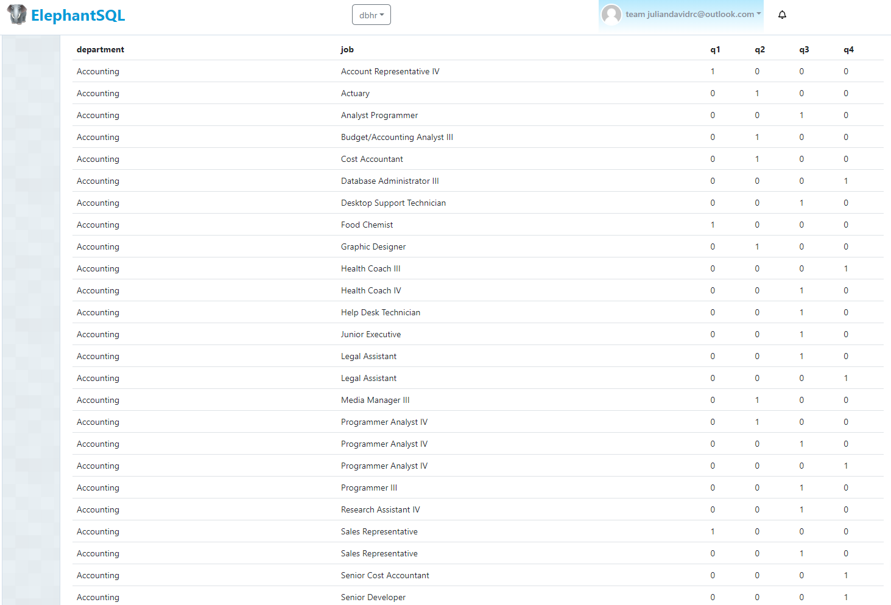
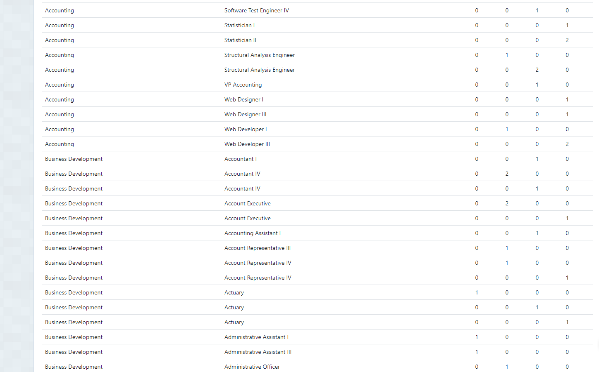
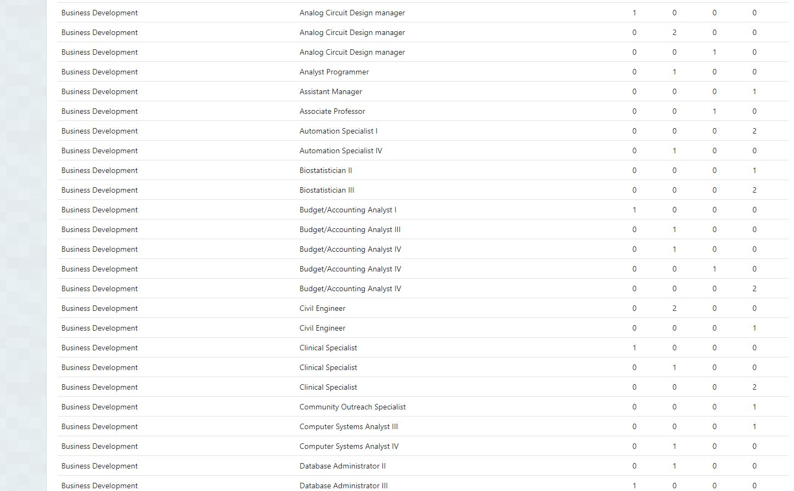
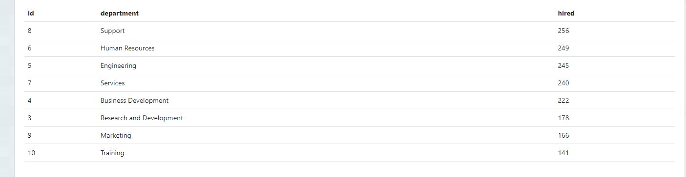
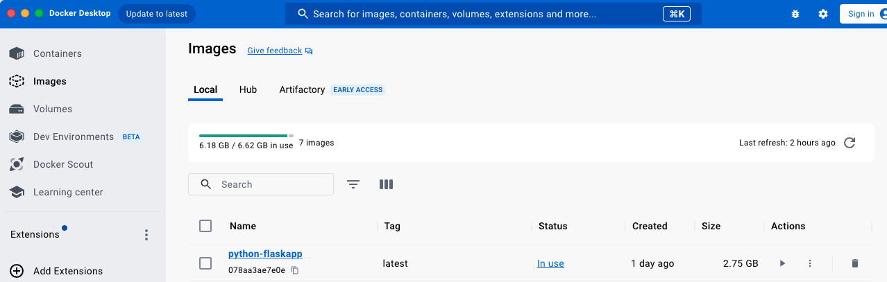
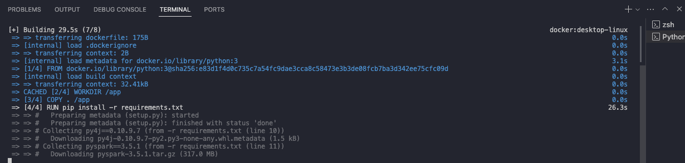
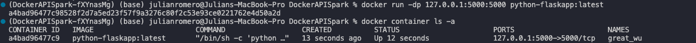

# RestApi Python/SQL Database + Docker flask/spark container

Endpoint to load batch 1 up to 1000 transactions (HTTP Post Request)

* Load dimension data (departments & jobs)
`http://127.0.0.1:5000/load/dims`

* Load hired employees data 
`http://127.0.0.1:5000/load/hired_employees`

Endpoint Query Analysis (HTTP GET Request)

* Query1: Number of employees hired for each job and department in 2021 divided by quarter. The table must be ordered alphabetically by department and job.
`http://127.0.0.1:5000/query/req1`, endpoint JSON result [jsonqry1](results_query_endpoint/qry1.json)

* Query2: List of ids, name and number of employees hired of each department that hired more employees than the mean of employees hired in 2021 for all the departments, ordered by the number of employees hired (descending).
`http://127.0.0.1:5000/query/req2`, endpoint JSON result [jsonqry2](results_query_endpoint/qry2.json)

## To call avro backup feature

The spark-avro module is external and not included in spark-submit or spark-shell by default.
You can also use --packages to add org.apache.spark:spark-avro_2.12 and its dependencies directly.
Documentation: `https://spark.apache.org/docs/3.5.1/sql-data-sources-avro.html`

    `Method PUT /backupAvro`

        os.system("/opt/homebrew/Cellar/apache-spark/3.5.1/bin/spark-submit --packages org.apache.spark:spark-avro_2.12:3.5.1 compressAvro.py &")

Avro backup saved on: `data/backup/avro/`

## Restore avro backup feature

    `Method PUT /restoreAvro`

Avro restored on: `data/backup/csv/_name_restored`

## Restore avro backup feature

    `Method PUT /restoreAvro`

Avro restored on: `data/backup/csv/_name_restored`

## Docker image deployment

Run:

    `docker build -t "python-flaskapp" .`

Once the image was created, run next command to deploy and run on port exposed:

    `docker run -dp 127.0.0.1:5000:5000 python-flaskapp:latest`

